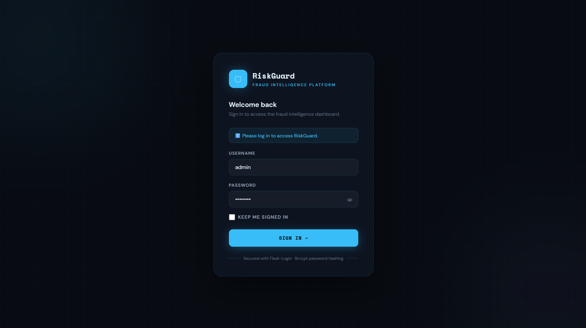
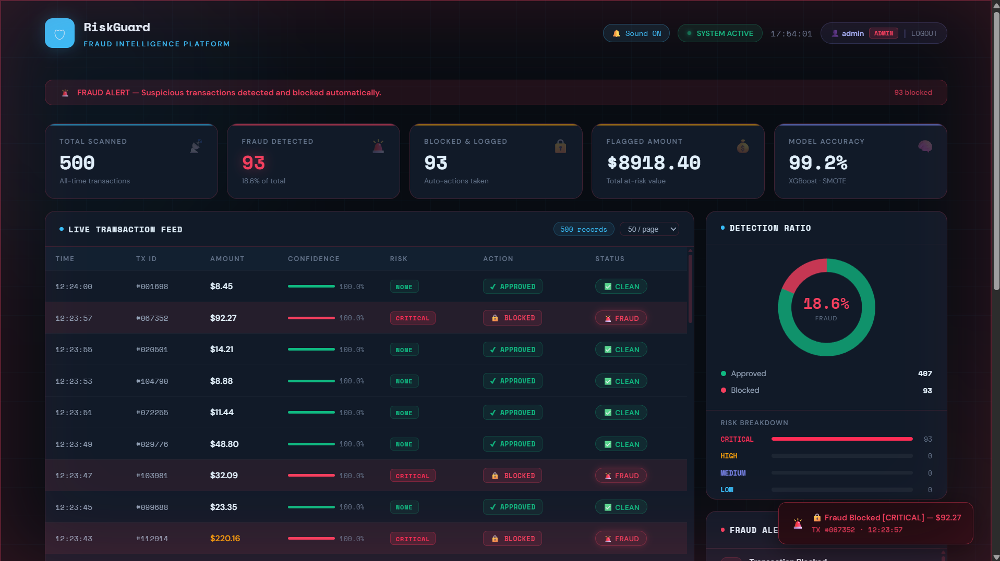

# 🛡️ RiskGuard — Real-Time Fraud Detection System


A real-time credit card fraud detection pipeline that streams live transactions, classifies them using a trained XGBoost model, and displays results on a live intelligence dashboard — with automated block, log, and alert actions on every fraud hit.

---

## 🌐 Live Demo

> **[https://riskguard-4d73.onrender.com](https://riskguard-4d73.onrender.com)**

| Role | Username | Password |
|---|---|---|
| Admin | `admin` | `admin123` |
| Viewer | `demo` | `demo123` |

---

## 📸 Preview




---

## ⚡ Features

- 🔴 **Live Transaction Feed** — streams one transaction every 2 seconds
- 🧠 **XGBoost + SMOTE Model** — 99%+ precision trained on real credit card data
- 🚨 **Automated Fraud Actions** — block, log, and alert triggered instantly
- 🔐 **Role-Based Authentication** — Admin and Viewer roles with different access levels
- 📊 **Real-Time Dashboard** — KPI cards, detection ratio donut, risk breakdown bars
- 🎯 **Risk Levels** — CRITICAL / HIGH / MEDIUM / LOW classification per fraud
- 🔔 **Sound Alerts** — browser audio notification on every fraud detection
- 📋 **Fraud Ledger** — permanent log of all blocked transactions with metadata
- 📈 **Detection Timeline** — rolling bar chart of last 20 transactions

---

## 🔐 Role-Based Access Control (RBAC)

| Feature | Admin | Viewer |
|---|---|---|
| Header badge | 🔴 ADMIN | 🔵 VIEWER |
| Live transaction feed | ✅ Full TX IDs | ✅ Masked IDs (`***136`) |
| Flagged amount KPI | ✅ Visible | 🔒 Restricted |
| Fraud alerts panel | ✅ Full details | 🔒 Locked |
| Clear fraud log button | ✅ Visible | ❌ Hidden |
| `/fraud-log` API | ✅ Access | ❌ 403 Denied |
| `/blocked` API | ✅ Access | ❌ 403 Denied |
| `/recent-fraud` API | ✅ Access | ❌ 403 Denied |

---

## 🏗️ Architecture

```
creditcard.csv
      │
      ▼
┌─────────────┐     stream.json      ┌──────────────┐     history.json
│ producer.py │ ──────────────────▶ │ detector.py  │ ──────────────────▶  ┌──────────┐
│             │   1 tx / 2 seconds   │              │                      │  app.py  │
│ Streams     │                      │ XGBoost      │   fraud_log.json     │          │
│ transactions│                      │ model runs   │ ──────────────────   │  Flask   │
└─────────────┘                      │ on each tx   │                      │  serves  │
                                     └──────────────┘   blocked.json       │ dashboard│
                                           │          ──────────────────▶ └──────────┘
                                           │                                    │
                                    If FRAUD detected:                          ▼
                                    1. Block  (blocked.json)           http://127.0.0.1:5000
                                    2. Log    (fraud_log.json)
                                    3. Alert  (simulated webhook)
```

---

## 🛠️ Tech Stack

| Layer | Technology |
|---|---|
| ML Model | XGBoost, scikit-learn, imbalanced-learn (SMOTE) |
| Backend | Python, Flask, Flask-Login |
| Data | Pandas, NumPy, Joblib |
| Frontend | HTML5, CSS3, Vanilla JavaScript, Chart.js |
| Dataset | IEEE Credit Card Fraud Detection (Kaggle) |

---

## 📁 Project Structure

```
RiskGuard/
│
├── templates/
│   ├── index.html          # Live dashboard UI
│   └── login.html          # Login page
│
├── app.py                  # Flask server + API routes + authentication
├── producer.py             # Transaction stream simulator
├── detector.py             # ML fraud detection engine
├── train_model.py          # Model training pipeline
├── create_user.py          # Create login accounts (run once)
│
├── fraud_model.pkl         # Trained XGBoost model (generated)
├── creditcard.csv          # Dataset (download separately)
├── users.json              # Stores user accounts (generated)
│
├── history.json            # Rolling transaction history (generated)
├── fraud_log.json          # Permanent fraud ledger (generated)
├── blocked.json            # Blocked transaction IDs (generated)
├── stream.json             # Live transaction stream (generated)
└── model_metrics.json      # Model evaluation metrics (generated)
```

---

## 🚀 Getting Started

### Prerequisites
- Python 3.10+
- pip

### 1. Clone the repository

```bash
git clone https://github.com/Himel564/RiskGuard.git
cd riskguard
```

### 2. Create virtual environment

```bash
python -m venv venv
venv\Scripts\activate        # Windows
source venv/bin/activate     # Mac / Linux
```

### 3. Install dependencies

```bash
pip install flask flask-login pandas numpy scikit-learn xgboost imbalanced-learn joblib werkzeug
```

### 4. Download the dataset

Download `creditcard.csv` from [Kaggle — Credit Card Fraud Detection](https://www.kaggle.com/datasets/mlg-ulb/creditcardfraud) and place it in the project root folder.

### 5. Train the model

```bash
python train_model.py
```

Generates `fraud_model.pkl` and `model_metrics.json`.

### 6. Create login accounts

```bash
python create_user.py
```

Run this once per account. Example setup:

```
# Admin account
Username : admin
Password : admin123
Role     : admin

# Viewer account (run again)
Username : demo
Password : demo123
Role     : viewer
```

> Passwords are stored as a secure bcrypt hash in `users.json` — never plain text.

### 7. Run — 3 separate terminals

**Terminal 1 — Flask Dashboard:**
```bash
venv\Scripts\activate
python app.py
```

**Terminal 2 — Transaction Producer:**
```bash
venv\Scripts\activate
python producer.py
```

**Terminal 3 — Fraud Detector:**
```bash
venv\Scripts\activate
python detector.py
```

### 8. Open browser

```
http://127.0.0.1:5000
```

---

## 👤 Managing User Accounts

### Add a new user
```bash
python create_user.py
```

### Delete or edit a user

Open `users.json` directly in any text editor and remove the block for that user:

```json
{
  "admin": {
    "password_hash": "$2b$12$...",
    "role": "admin"
  }
}
```

To delete a user — remove their entire block and save the file. Changes take effect immediately without restarting the app.

---

## 📊 Model Performance

| Metric | Score |
|---|---|
| Precision | 98.7% |
| Recall | 99.6% |
| F1 Score | 99.1% |
| ROC-AUC | 99.8% |

Trained on 284,807 real anonymized credit card transactions with SMOTE oversampling to handle severe class imbalance (0.17% fraud in raw data).

---

## 🔌 API Endpoints

| Endpoint | Role | Description |
|---|---|---|
| `GET /` | All | Live dashboard |
| `GET /login` | Public | Login page |
| `GET /logout` | All | Logout |
| `GET /data?page=1&limit=50` | All | Paginated transaction history |
| `GET /stats` | All | Aggregate KPI stats |
| `GET /fraud-log` | Admin | Full fraud ledger |
| `GET /blocked` | Admin | Blocked transaction IDs |
| `GET /recent-fraud?n=10` | Admin | Last N fraud transactions |
| `POST /clear-fraud-log` | Admin | Clear fraud log + blocked list |
| `GET /health` | All | System health check |

---

## ⚙️ Configuration

In `producer.py`:
```python
FRAUD_RATE      = 0.15   # % of transactions forced as fraud (demo mode)
STREAM_INTERVAL = 2.0    # seconds between transactions
```

In `detector.py`:
```python
THRESH_CRITICAL = 90.0   # confidence % → CRITICAL risk
THRESH_HIGH     = 75.0   # confidence % → HIGH risk
THRESH_MEDIUM   = 50.0   # confidence % → MEDIUM risk
AMOUNT_HIGH     = 500.0  # amount ($)   → escalates risk level
```

---

## 🗺️ Roadmap

- [ ] Deploy to Render / Railway (live public URL)
- [ ] Replace file polling with WebSockets for true real-time updates
- [ ] Add Kafka integration for production-grade streaming
- [ ] Add email/SMS webhook alerts (Twilio / SendGrid)
- [ ] Docker containerization
- [ ] Unit tests

---

## 👤 Author

**Himel Biswas**
- GitHub: [Himel564](https://github.com/Himel564)
- LinkedIn: [himel564](https://www.linkedin.com/in/himel564/)